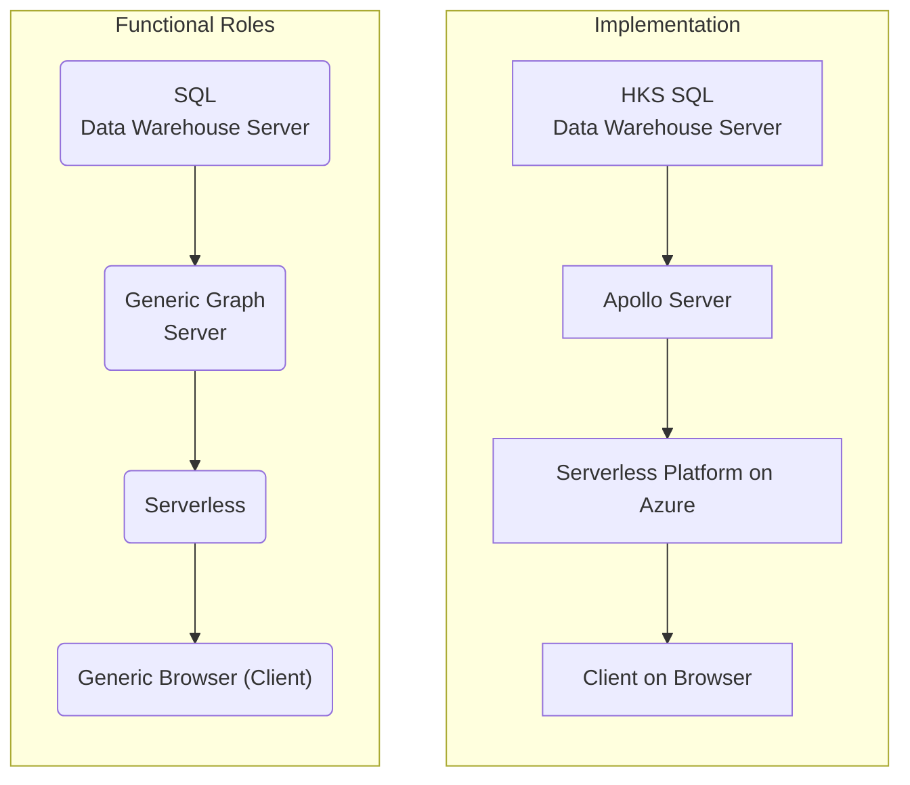

# Functional Roles Software Implementation
"Functional Roles" is an abstract model of the functional roles present within the system  "Implementation" is demonstrating specifc types of software used to implement those functional roles within JCB
---

